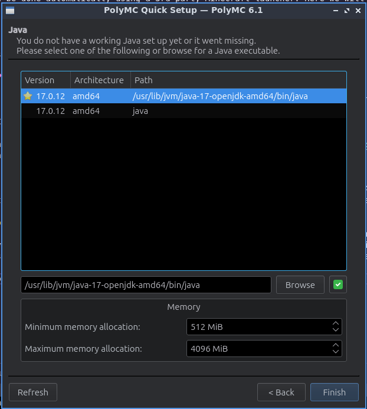
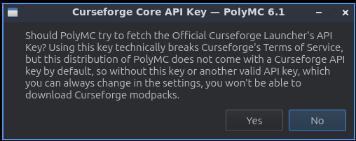
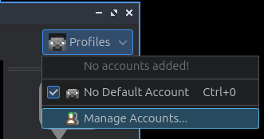
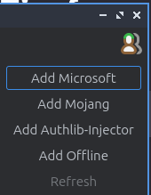
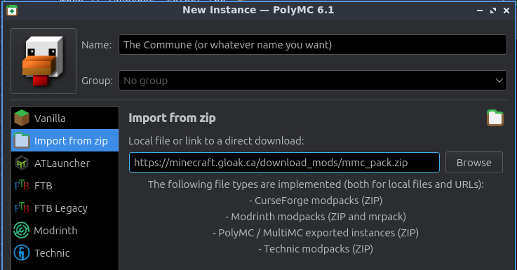

+++
title = "Join the Gloak commune"
description = "Want to know how to join my minecraft server? Here's how!"
+++



# Joining the Minecraft server

To join the Minecraft Server, there are some prerequisites.

1. You must own "Minecraft: Java Edition", this is the moddable version for PC and Mac.
    - To check whether or not you have "Minecraft: Java Edition", [log into your profile on minecraft.net profile](https://www.minecraft.net/en-us/msaprofile) using your Microsft/Xbox-Live account.
	- If there's _no_ "Buy Now" button under "Minecraft: Java Edition", you're good.

2. You must be running the same version of Minecraft as the server, with all the same mods installed.
    - This can be done automatically using a 3rd party Minecraft launcher. Here we will be using [PolyMC](https://polymc.org/) which allows you to use multiple different profiles for minecraft independent of the official launcher.





# Setting up PolyMC

Here are some instructions on set up PolyMC to install the right version of Minecraft and all the mods I'm using.

(TODO: ADD PICTURES!!)

1. Download Java 17. For example, [Microsoft's OpenJDK](https://learn.microsoft.com/en-ca/java/openjdk/download#openjdk-17).
    - Which one to install depends on your system
        - The one ending in "windows-x64.msi" is the best for windows
		- The one ending in "macos-x64.pkg" is for Macs running intel-based CPUs
		- The one ending in "macos-aarch64.pkg" is for Macs running M-series CPUs, all Apple computers sold after 2020 are in this category.
    - Unlike the official Minecraft Launcher, PolyMC does not include Java itself and requires it to be installed seperately.

2. [Install PolyMC](https://polymc.org/download/)
    - When it launches, select the version of Java 17 with the star on it. This should match what you have installed.
	- 
	- If your system has lots of RAM, you can increate the "Maximum memory allocation". 50% to 80% of your system's RAM is usually good.
	- If it asks you to use the Curseforge API, say "**no**". We aren't using that to update the mods anyway.
	- 

3. Link your Minecraft account with PolyMC
    - On the top-right of PolyMC, there's a "Profiles" button. Press that, then press "manage accounts"
	- 
	- Log into your Minecraft account using the "Add Microsoft" button. This also works for XBox-Live.
	- 
	- Your Minecraft account should now be on the list. You can now close it.

4. Have PolyMC Download the mod pack
    - Press "Add Instance" on the top-left
	- 
	- Select "Import from zip"
	- Use whatever name you wish, e.g. "The Commune"
	- Paste in the following link: [https://minecraft.gloak.ca/download_mods/mmc_pack.zip](https://minecraft.gloak.ca/download_mods/mmc_pack.zip)
        - If you've already downloaded the zip file, you can press "browse" to have PolyMC open it.
	- 
	- Select "OK" when you're done.

That's it! You may now select the PolyMC instance you've created, then click "launch" to start the game.

The mod pack also automatically adds my Minecraft server in the "Multiplayer" section.

Note: Do not update the mods or the game yourself. Your game must be running the same version of the game and mods as the server to run properly. Should we add a new mod, update it, etc. PolyMC will auto-install the matching version next time you launch the game.


